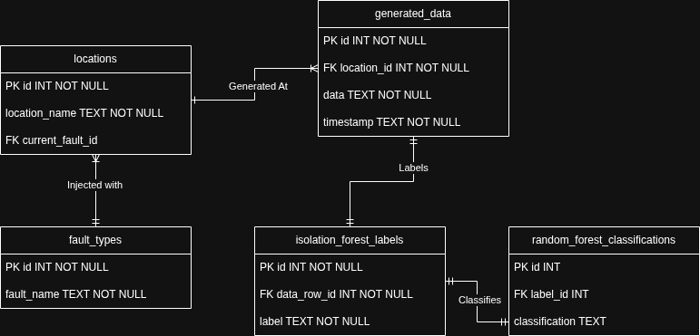
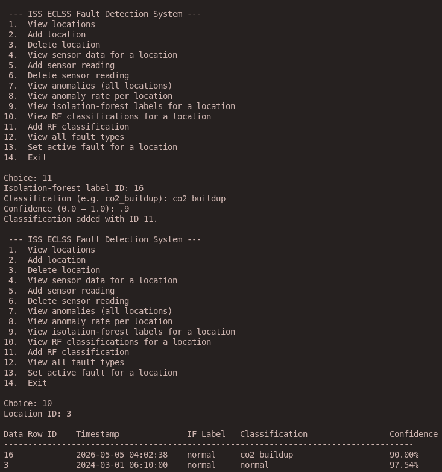
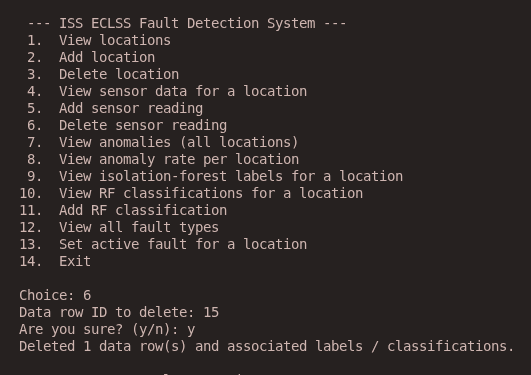

# HUNCH-Database-Upgrade
This is an experimental change to our HUNCH project that alters the database to make it more structured

## ERD



## Requirements
 - [Docker](https://docs.docker.com/engine/install/)
 - This works well with Python version 3.12.3, but it should work on other Python 3 verions

## How to Setup
1. Install [Docker](https://docs.docker.com/engine/install/)
2. Clone this repository
  ```bash
  git clone https://github.com/Fooot-Code/HUNCH-Database-Upgrade.git
  ```
3. Navigate to the same directory that this README is in.
   * This is important because the script and Python files assume you are in this directory. Run `pwd` and it should end with `.../HUNCH-Database-Upgrade`
5. Run the `run.sh` script
 ```bash
 bash ./Execution/run.sh
 ```
5. This will pull the Docker image, start the Docker container, create the Python Virtual Environment, install dependencies, and run the `main.py` file with the new venv
6. Enjoy the Fault Detection System Interface

## Feature List
 1.  View locations
 2.  Add location
 3.  Delete location
 4.  View sensor data for a location
 5.  Add sensor reading
 6.  Delete sensor reading
 7.  View anomalies (all locations)
 8.  View anomaly rate per location
 9.  View isolation-forest labels for a location
10.  View RF classifications for a location
11.  Add RF classification
12.  View all fault types
13.  Set active fault for a location
14.  Exit

## Example Images
#### Inserting a Random Forest Classification into a certain location:


#### Deleting a sensor reading from a specific location:


## Limitations
 - Very basic design.
 - Not the most user friendly.
 - Script must be run from the same directory as README

## Reflection
One of the main challenges we faced was the fact that our database design was already pretty good. The way it was designed made a lot of sense to us since we had worked with it a lot, so it was hard to try and stray away from it. It was also a challenge because we originally wanted to integrate this new design into our actual project, but we realized that we would either have to edit this design to fit perfectly with the functions we had, or change the database file and everything that depends on it. We ended up choosing to create a new project entirely because it allowed our database design to shine without being limited by the structure of our previous data structure.

Our choice to stray away from our actual HUNCH project made us realize that it is hard to change something that seems small when a lot depends on it. Our database file was only ~200 lines, so it was suprising when we kept trying and failing to edit that one. Another thing we learned from this project was that making a startup script is very usefull but also challenging. It has to handle all dependencies as well as running the main program. This main program also has its own way of starting up (e.g. `database.py`'s __init__ function) which can interfere with what the startup script is doing.

Overall, this project helped us better understand the challenges of modifying existing systems and the importance of designing with adaptability in mind.
